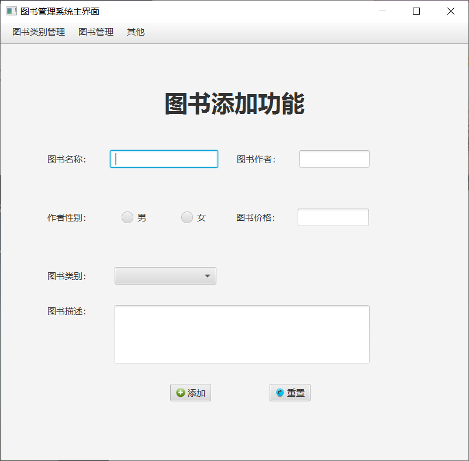
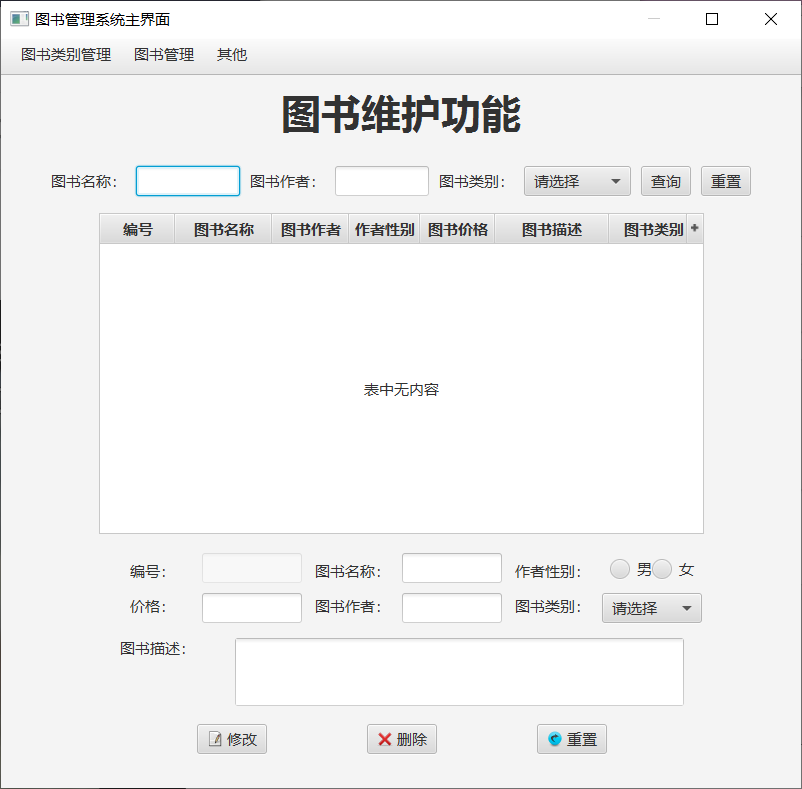
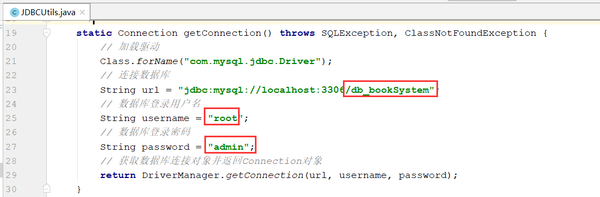

[toc]

需导入javafx-media包 实现播放声音

# BookManageSystem_javafx

## 项目介绍

图书管理系统，通过swing展示数据。

运行截图如下：

- 登录页面

登录账户，这里没有调用数据库，而是使用默认唯一账户：（**用户名：张三；密码：123456**）。

- 主界面

- 图书添加

- 图书维护

## 使用指导

第一步：修改数据库连接参数在JDBCUtils.java中的getConnection()方法中

第二步：运行Main.java类的main()方法。

第三步：登录账户，这里没有调用数据库，而是使用默认唯一账户：（**用户名：张三；密码：123456**）。

## 目录说明

- file

该目录下有两个文件，其中是一个连接MySQL数据库所需要的jar包，另一个是项目所使用的数据库表SQL，需要先创建名为db_booksystem的数据库，再在其下执行该db_booksystem.sql中的语句。

- images

该目录下存放的是README.md文件中所需要用到的图片资源。

- src

该目录下是本项目的源代码。

